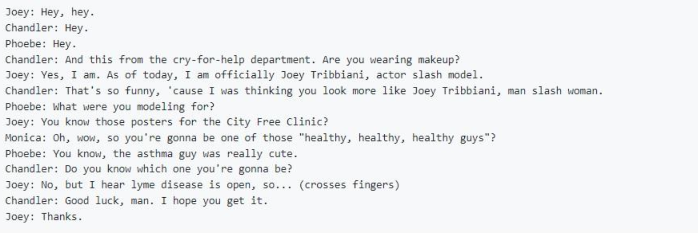

# ATON_test
## About

Тестовые задания для стажёра 

## Команда корпоративной шины данных и микосервисов
##In memory simple DB

Задача реализовать in memory кэш с возможностью быстрого поиска по разным полям.
Структура данных представлена следующим набором полей: 
{
"account": "234678", //long
"name": "Иванов Иван Иванович", //string 
"value": "2035.34" //double
}
Количество записей заранее не определено и может меняться динамически.
Необходимо организовать хранение этих записей в памяти с соблюдением требований:
1. предоставить возможность добавлять новые записи;
2. предоставить возможность удалять более не нужные записи;
3. предоставить возможность изменять запись;
4. получать полный набор записи по любому из полей с одинаковой алгоритмической сложностью (не медленнее log(n));
5. выбрать наиболее экономный способ хранения данных в памяти.

## Launch
1. Download/Clone this repo

        git clone https://github.com/Alex5067/ATON_test
        
2. `cd` into the root directory

        cd ATON_DB
        javac Main.java
        java Main.java

## Команда технологий фонт-офиса
##Threads

Задача написать программу, в которой 6 тредов: Chandler, Joey, Monica, Phoebe, Rachel и Ross разыгрывают в консоли сценки из ситкома. Каждый печатает свое имя и реплику.
Сценка дана в тексте такого формата:

## Launch
1. Download/Clone this repo

        git clone https://github.com/Alex5067/ATON_test
        
2. `cd` into the root directory

        cd ATON_Thread
        c++ thread.cpp -std=c++17
        ./a.out

